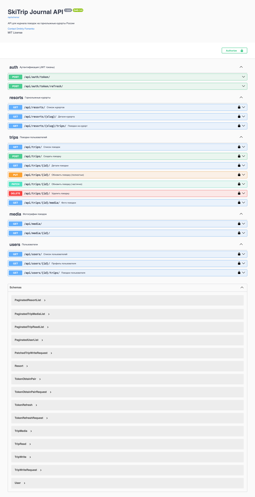

# 🎿 SkiTrip Journal

> Веб-приложение для ведения журнала поездок на горнолыжные курорты России

[](https://www.python.org/)
[](https://www.djangoproject.com/)
[](https://www.django-rest-framework.org/)
[](https://www.postgresql.org/)
[](https://redis.io/)
[](https://docs.celeryq.dev/)
[](https://www.docker.com/)
[](https://github.com/dmitriy347/MountainTrip)
[](https://snowlog.ru)
[](https://github.com/dmitriy347/MountainTrip/actions/workflows/cd.yml)

---

## 📋 Основные возможности

- 📝 Личный журнал поездок на горнолыжные курорты
- 🏔️ База данных курортов России
- 📸 Загрузка фотографий с поездок
- 🔒 Публичные и приватные поездки
- 🔐 OAuth через GitHub
- 🔌 REST API с JWT аутентификацией
- 🛡️ Rate Limiting для защиты API от злоупотреблений
- ⚡ Асинхронная генерация миниатюр (Celery)
- 🚀 Production-ready (CI/CD, Docker, SSL)


**Демо:** [snowlog.ru](https://snowlog.ru)  
**API Docs:** [snowlog.ru/api/docs](https://snowlog.ru/api/docs/)

---

## 🛠️ Технологии

### Backend:
- **Python 3.11** - язык программирования
- **Django 5.1** - веб-фреймворк
- **Django REST Framework 3.15** - REST API
- **PostgreSQL 16** - реляционная база данных
- **Redis 7** - кэширование и очереди задач
- **Celery 5.4** - асинхронная обработка задач


### API:
- **JWT Authentication** - безопасная аутентификация
- **drf-spectacular** - автогенерация OpenAPI/Swagger документации
- **django-filter** - фильтрация и поиск по API
- **DRF Throttling** - многоуровневый rate limiting с хранением в Redis


### Frontend:
- **Bootstrap 5** - CSS-фреймворк
- **HTML/CSS/JavaScript** - вёрстка и интерфейс

### DevOps:
- **Docker & Docker Compose** - контейнеризация
- **GitHub Container Registry (ghcr.io)** - хранение Docker образов
- **Nginx** - веб-сервер и reverse proxy
- **Gunicorn** - WSGI HTTP Server
- **GitHub Actions** - CI/CD pipeline (lint → test → build → deploy)
- **Let's Encrypt** - SSL сертификаты

### Тестирование:
- **pytest** - фреймворк для тестирования
- **pytest-django** - интеграция Django с pytest
- **pytest-cov** - покрытие кода тестами

---

## 🏗️ Архитектура
```

┌───────────────┐      ┌──────────────┐      ┌──────────────┐
│     Nginx     │─────▶│   Gunicorn   │─────▶│  PostgreSQL  │
│(Reverse Proxy)│      │   (Django)   │      │              │
└───────────────┘      └──────────────┘      └──────────────┘
                              │
                   ┌──────────┴──────────┐ 
                   ▼                     ▼
         ┌────────────────┐       ┌────────────────┐
         │     Redis      │ ────▶ │     Celery     │
         │(Cache + Broker)│       │     Worker     │
         └────────────────┘       └────────────────┘
```
### Поток запроса:

1. Клиент отправляет HTTP-запрос.
2. Nginx принимает запрос и проксирует его в Gunicorn.
3. Gunicorn передаёт запрос Django-приложению.
4. Django:
   - работает с PostgreSQL (основная БД),
   - использует Redis для кэширования,
   - отправляет тяжёлые задачи (генерация thumbnail) в очередь Redis.
5. Celery Worker забирает задачи из очереди и выполняет их асинхронно.
6. Ответ возвращается клиенту немедленно, не дожидаясь завершения задачи.

---

## 📚 Что я изучил в этом проекте

### База данных и производительность:
- Оптимизация запросов через `select_related` / `prefetch_related` - снижение N+1 проблемы
- Добавление индексов в моделях для ускорения фильтрации и сортировки
- Проектирование структуры БД в PostgreSQL

### REST API:
- Проектирование REST API: ViewSets, Serializers, JWT, фильтрация, пагинация
- JWT-аутентификация (access/refresh токены) через SimpleJWT
- Фильтрация, поиск и сортировка через django-filter
- Настройка Rate Limiting: защита эндпоинтов через `AnonRateThrottle` / `UserRateThrottle`

### Асинхронность:
- Настройка Celery + Redis как брокера задач
- Асинхронная генерация thumbnail при загрузке фото (Django Signals → Celery Task)
- Retry-механизм для устойчивости задач при сбоях
- Изоляция Celery в тестах через `CELERY_TASK_ALWAYS_EAGER`

### Кэширование:
- Реализация кэширования через Redis с инвалидацией
- Разделение Redis на базы: кэш (db/1) и брокер Celery (db/0)

### DevOps и деплой:
- Контейнеризация приложения: Dockerfile, docker-compose
- Разделение конфигов: `docker-compose.yml` (dev) и `docker-compose.prod.yml` (prod)
- Настройка CI/CD pipeline на GitHub Actions для линтинга, тестирования, сборки Docker образов и деплоя на VPS
- Настройка production-окружения: Nginx, Gunicorn, SSL (Let's Encrypt)
- Автоматические бэкапы БД в Yandex Object Storage

### Тестирование
- Изоляция тестового окружения: отдельный `settings_test.py`
- Покрытие проекта автотестами: pytest, fixtures, >80% coverage

---

## 🚀 Быстрый старт с Docker

### 1. Клонируй репозиторий:
```bash
git clone https://github.com/dmitriy347/MountainTrip.git
cd MountainTrip
```

### 2. Настрой переменные окружения:
```bash
cp .env.example .env
```
Отредактируй `.env`:
- `SECRET_KEY` - обязательно
- `GITHUB_CLIENT_ID` и `GITHUB_CLIENT_SECRET` - опционально для OAuth

### 3. Запусти Docker:
```bash
docker-compose up --build
```
Приложение доступно по адресу: **http://localhost:8000**  

### 4. Демо-данные:
После запуска Docker автоматически загружаются:
- Тестовые горнолыжные курорты
- Демонстрационные пользователи
- Тестовые поездки с фотографиями

### 5. Демо-аккаунты:
- **Админ:** `admin` / `admin123`
- **Пользователь:** `testuser` / `testuser`

---

## 🔌 REST API

Проект предоставляет полнофункциональный REST API для интеграции с мобильными приложениями и внешними сервисами.

### Документация API:

- **Swagger UI:** [http://localhost:8000/api/docs/](http://localhost:8000/api/docs/) - интерактивная документация
- **ReDoc:** [http://localhost:8000/api/redoc/](http://localhost:8000/api/redoc/) - альтернативный просмотр
- **OpenAPI Schema:** [http://localhost:8000/api/schema/](http://localhost:8000/api/schema/) - JSON схема
- **Детальное руководство:** [API_GUIDE.md](API_GUIDE.md)

### Postman Collection:

Готовая коллекция запросов для тестирования API:  
1. Скачай **[Postman Collection](./postman/SkiTrip_API.postman_collection.json)**  
2. Скачай **[Окружение Local](./postman/local.postman_environment.json)**
3. Импортируй файлы в Postman
4. Получи токен через `/auth/token/`
5. Используй остальные запросы

### Основные возможности API:

- **Курорты:** `GET /api/resorts/` - список курортов с фильтрацией
- **Поездки:** `CRUD /api/trips/` - полное управление поездками
- **Медиа:** `GET /api/media/` - фотографии поездок
- **Пользователи:** `GET /api/users/` - профили пользователей
- **JWT Auth:** `/api/auth/token/` - аутентификация через токены

---

## 🛡️ Безопасность API

### Rate Limiting (DRF Throttling):

API защищён многоуровневой системой ограничения запросов на основе DRF Throttling с хранением счётчиков в Redis.

| Тип пользователя | Эндпоинт | Лимит | Защита от |
|-----------------|----------|-------|-----------|
| Гость (по IP) | Все API эндпоинты | 10 запросов/мин | DDoS, парсинг |
| Авторизованный | Все API эндпоинты | 100 запросов/мин | Злоупотреблений |
| Любой | `POST /api/auth/token/` | 5 попыток/мин | Bruteforce паролей |
| Авторизованный | `POST /api/trips/` | 10 запросов/час | Спам записей |

**Ответ при превышении лимита:**
```bash
HTTP 429 Too Many Requests
{
  "detail": "Запрос был проигнорирован. Expected available in 22 seconds."
}
```

### Реализация:
- Глобальные лимиты через `DEFAULT_THROTTLE_CLASSES` в настройках DRF
- Кастомные throttles для критичных эндпоинтов (`AuthThrottle`, `TripCreateThrottle`)
- Раздельные лимиты для разных действий внутри ViewSet через `get_throttles()`
- Счётчики хранятся в Redis (быстро, без нагрузки на БД)

---

## 🌐 Production Deployment

### Инфраструктура:
- **Хостинг:** VPS на Ubuntu 24.04 LTS
- **Домен:** [snowlog.ru](https://snowlog.ru)
- **SSL:** Let's Encrypt (автоматическое обновление)
- **Веб-сервер:** Nginx + Gunicorn
- **База данных:** PostgreSQL 16 в Docker
- **Кэш:** Redis 7 в Docker
- **Celery** - асинхронный воркер для обработки задач
- **Бэкапы:** Автоматические бэкапы БД в Yandex Object Storage (ежедневно)

---

## 📸 Скриншоты
**Главная страница**

**Список курортов**

**Список поездок пользователя**

**Детали поездки**

**Swagger API документация**


---

## 🗂️ Структура проекта
```
MountainTrip/
├── config/                  # Django проект
│   ├── config/              # Настройки проекта
│   │   ├── settings.py      # Основные настройки
│   │   ├── settings_test.py # Настройки для тестов
│   │   ├── urls.py          # Главный URL-роутинг
│   │   ├── celery.py        # Конфигурация Celery
│   │   └── wsgi.py          # WSGI конфигурация
│   │
│   ├── fixtures/            # Демонстрационные данные
│   │   ├── resorts.json     # 15 курортов России
│   │   ├── users.json       # Тестовые пользователи
│   │   ├── trips.json       # Поездки
│   │   └── trip_media.json  # Фотографии поездок
│   │
│   ├── resort/              # Основное приложение
│   │   ├── models.py        # Модели: Resort, Trip, TripMedia
│   │   ├── views.py         # Class-based views
│   │   ├── forms.py         # Формы создания поездок
│   │   ├── urls.py          # URL-маршруты
│   │   ├── admin.py         # Настройки админ-панели
│   │   ├── signals.py       # Сигналы (удаление файлов, кэш)
│   │   ├── tasks.py         # Асинхронные задачи Celery
│   │   ├── cache_keys.py    # Управление кэшем
│   │   ├── mixins.py        # OwnerQuerySetMixin
│   │   ├── tests/           # Тесты
│   │   └── api/             # REST API
│   │       ├── serializers.py   # DRF serializers
│   │       ├── views.py         # ViewSets
│   │       ├── urls.py          # API роутинг
│   │       ├── filters.py       # Фильтры для django-filter
│   │       ├── permissions.py   # Кастомные permissions
│   │       ├── throttles.py     # Rate Limiting
│   │       └── tests/           # Тесты
│   │
│   ├── users/               # Приложение пользователей
│   │   ├── views.py         # Login, Logout, Register, Profile
│   │   ├── forms.py         # Формы регистрации
│   │   ├── urls.py          # URL-маршруты
│   │   └── tests/           # Тесты
│   │
│   ├── static/              # Статические файлы
│   │   └── robots.txt       # SEO конфигурация
│   │
│   ├── templates/           # HTML шаблоны
│   │   └── base.html        # Базовый шаблон
│   │
│   └── manage.py            # Django CLI
│
├── .github/workflows/       # GitHub Actions
│   ├── cd.yml               # CI/CD pipeline (lint, test, build, deploy)
│   └── backup.yml           # Автоматические бэкапы БД│
│
├── Dockerfile               # Docker образ приложения
├── docker-compose.yml       # Оркестрация сервисов
├── entrypoint.sh            # Скрипт инициализации контейнера
├── requirements.txt         # Python зависимости
├── requirements-dev.txt     # Dev/testing зависимости
├── .flake8                  # Flake8 конфигурация
├── pytest.ini               # Pytest конфигурация
├── pyproject.toml           # Black конфигурация
├── .env.example             # Пример переменных окружения
├── README.md                # Этот файл
└── API_GUIDE.md             # Подробное руководство по API
```

---

## Автор

**Dmitriy Fomenko**

- GitHub: [@dmitriy347](https://github.com/dmitriy347)
- Email: d.fomenko95@gmail.com
- LinkedIn: [dmitriy-fomenko](https://www.linkedin.com/in/dmitriy-fomenko-457188388)

---

## Лицензия

Этот проект создан в образовательных целях и доступен под лицензией [MIT](https://opensource.org/licenses/MIT).

---

## Благодарности

- [Django](https://www.djangoproject.com/) - за отличный веб-фреймворк
- [Django REST Framework](https://www.django-rest-framework.org/) - за мощный инструмент для API
- [Bootstrap](https://getbootstrap.com/) - за готовые UI компоненты
- [pytest](https://pytest.org/) - за удобное тестирование
- [drf-spectacular](https://drf-spectacular.readthedocs.io/) - за автогенерацию документации

---

**⭐ Если проект понравился, поставьте звезду на GitHub!**