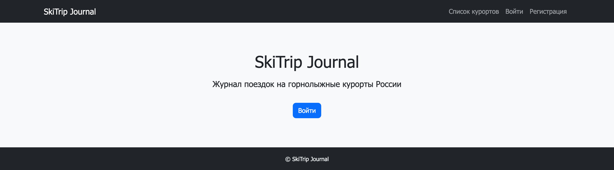
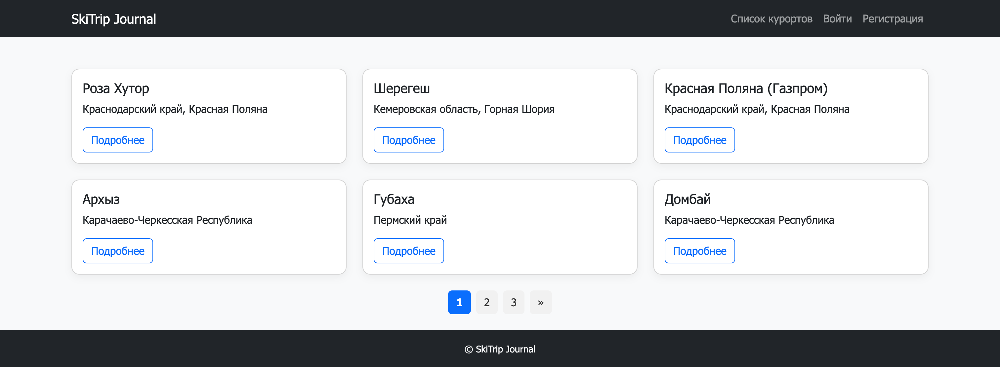
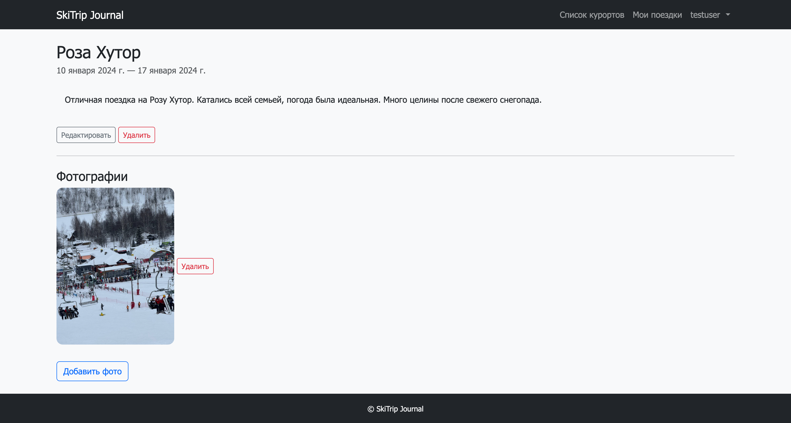

# 🎿 SkiTrip Journal

> Веб-приложение для ведения журнала поездок на горнолыжные курорты России

[](https://www.python.org/)
[](https://www.djangoproject.com/)
[](https://www.postgresql.org/)
[](https://redis.io/)
[](https://www.docker.com/)
[](https://github.com/dmitriy347/MountainTrip)
[](https://github.com/dmitriy347/MountainTrip)

---

## 📋 О проекте

**SkiTrip Journal** — это веб-приложение для любителей горнолыжного спорта, которое позволяет:

- ✅ Вести личный журнал поездок на горнолыжные курорты
- 🏔️ Просматривать информацию о курортах России
- 📸 Загружать фотографии с поездок
- 🔒 Делать поездки публичными или приватными
- 👥 Просматривать публичные поездки других пользователей
- 🔐 Авторизация через GitHub (OAuth)

---

## 🛠️ Технологии

### Backend
- **Python 3.11** — язык программирования
- **Django 5.1** — веб-фреймворк
- **PostgreSQL 17** — основная база данных
- **Redis 7** — кэширование данных
- **Django AllAuth** — авторизация (включая GitHub OAuth)
- **Docker & Docker Compose** — контейнеризация

### Frontend
- **Bootstrap 5** — UI фреймворк
- **HTML/CSS** — разметка и стили

### Testing & Quality
- **pytest + pytest-django**
- **pytest-cov** — проверка покрытия кода тестами (99%)

---

## 🚀 Быстрый старт с Docker

### Требования

- [Docker Desktop](https://www.docker.com/products/docker-desktop/) (Mac/Windows/Linux)
- [Git](https://git-scm.com/)

---

### 1. Клонируй репозиторий
```bash
git clone https://github.com/dmitriy347/MountainTrip.git
cd MountainTrip/config
```

### 2. Настрой переменные окружения
```bash
cp .env.example .env
```
Отредактируй `.env` (SECRET_KEY обязателен, GitHub OAuth опционален).


### 3. Запусти Docker
```bash
docker-compose up --build
```
Приложение доступно по адресу: http://localhost:8000

После запуска Docker автоматически:
- создаются демонстрационные пользователи
- загружаются курорты и поездки

[//]: # (- добавляются демонстрационные фотографии поездок)

**Демо-аккаунты:**
- Админ: `admin` / `admin123` (http://localhost:8000/admin)
- Пользователь: `testuser` / `testuser`

### 4. GitHub OAuth (опционально)
Проект поддерживает авторизацию через GitHub OAuth.

**По умолчанию:** OAuth отключен, используется стандартная авторизация.

Использование GitHub OAuth необязательно и включается через переменные окружения: `GITHUB_CLIENT_ID` и `GITHUB_CLIENT_SECRET`.

---

## 📸 Скриншоты
**Главная страница**

**Список курортов**

**Список поездок пользователя**

**Детали поездки**


---

## 🗂️ Структура проекта
```
MountainTrip/
├── config/                  
│   ├── config/              # Настройки проекта
│   │   ├── settings.py      # Основные настройки
│   │   ├── settings_test.py # Настройки для тестов
│   │   ├── urls.py          # Главный URL-роутинг
│   │   └── wsgi.py
│   │
│   ├── resort/              # Приложение курортов и поездок
│   │   ├── models.py        # Модели: Resort, Trip, TripMedia
│   │   ├── views.py         # Представления (CBV)
│   │   ├── forms.py         # Формы для создания поездок
│   │   ├── urls.py          # URL-маршруты приложения
│   │   ├── admin.py         # Настройки админ-панели
│   │   ├── signals.py       # Сигналы (удаление файлов, кэш)
│   │   ├── cache_keys.py    # Централизованное управление кэшем
│   │   ├── mixins.py        # OwnerQuerySetMixin
│   │   ├── templates/       # Шаблоны приложения
│   │   └── tests/           # Тесты
│   │       ├── conftest.py  # Общие фикстуры
│   │       ├── test_models.py
│   │       ├── test_views.py
│   │       └── test_urls.py
│   │
│   ├── users/               # Приложение пользователей
│   │   ├── views.py         # Login, Logout, Register, Profile
│   │   ├── forms.py         # Кастомные формы регистрации
│   │   ├── urls.py          # URL-маршруты приложения
│   │   └── tests/           # Тесты
│   │       ├── conftest.py
│   │       └── test_views.py
│   │
│   ├── templates/           # Общие шаблоны
│   │   ├── base.html        # Базовый шаблон
│   │   └── registration/    # Шаблоны смены пароля
│   │
│   ├── manage.py            # Утилита управления Django
│   └── pytest.ini           # Конфигурация pytest
│
├── media/                   # Загруженные пользователями файлы
│   └── trip_photos/         # Фотографии поездок
│
├── Dockerfile               # Конфигурация сборки образа
├── docker-compose.yml       # Оркестрация сервисов
├── entrypoint.sh            # Скрипт инициализации контейнера
├── requirements.txt         # Зависимости проекта
└── requirements-dev.txt     # Development/testing зависимости
```

---

## Ключевые особенности

### Модели данных

- **Resort** — Справочник горнолыжных курортов
  - `name`, `region`, `description`, `slug`
  - Автогенерация slug из названия


- **Trip** — Поездки пользователей
  - Связь с `User` и `Resort`
  - `is_public` — флаг публичности
  - Валидация дат (начало < окончания)


- **TripMedia** — Фотографии поездок
  - Связь с `Trip`
  - Автоудаление файлов при удалении записи (signals)

### Архитектурные решения

 **Кэширование с Redis**
- Список курортов кэшируется на 10 минут
- Счётчики поездок кэшируются
- Автоматическая инвалидация кэша через signals

 **Оптимизация запросов**
- `select_related()` для связанных объектов
- `prefetch_related()` для обратных связей
- Индексы на часто используемые поля

 **Права доступа**
- `LoginRequiredMixin` — для авторизованных пользователей
- `OwnerQuerySetMixin` — владелец видит только свои записи
- Публичные поездки видны всем авторизованным

 **Безопасность**
- CSRF защита
- Валидация форм
- Санитизация пользовательского ввода

---

## 🚀 Планы по развитию

- [ ] REST API (Django REST Framework)
- [ ] CI/CD (GitHub Actions)
- [ ] Деплой на Railway/Render
- [ ] Экспорт поездок в PDF/Excel
- [ ] Карта с отметками курортов (Leaflet/Yandex Maps)
- [ ] Celery для фоновых задач (отправка email)

---

## 👨‍💻 Автор

**Dmitriy Fomenko**

- GitHub: @dmitriy347 (https://github.com/dmitriy347)
- Email: d.fomenko95@gmail.com
- LinkedIn: dmitriy-fomenko-457188388 (www.linkedin.com/in/dmitriy-fomenko-457188388)

---

## 📝 Лицензия

Этот проект создан в образовательных целях и доступен под лицензией [MIT](https://opensource.org/licenses/MIT).

---

## 🙏 Благодарности

- [Django](https://www.djangoproject.com/) — за отличный веб-фреймворк
- [Bootstrap](https://getbootstrap.com/) — за готовые UI компоненты
- [pytest](https://pytest.org/) — за удобное тестирование

---

**⭐ Если проект понравился, поставьте звезду на GitHub!**